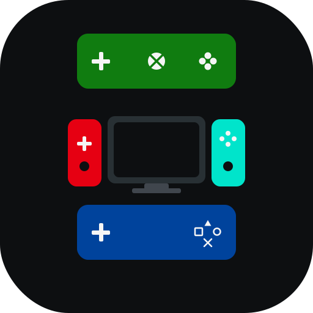

# EmuStack

EmuStack is a desktop utility for downloading, updating, launching, and managing Nintendo Switch emulator builds from multiple providers — the successor to the Yuzu Toolbox project.

It is built with Godot 4.6 and C# (.NET 8) and runs on Windows, Linux, and macOS.

## What it can do

### Multi-provider emulator installs
- **Provider registry** with support for Eden, Ryubing, and legacy Ryujinx targets.
- **Per-provider settings** for install, mod, save, and app-data directories.
- **Automatic platform detection** for Windows, Linux, and macOS, with architecture-aware download selection.
- **Auto-unpack** archives, set Linux executable permissions, and surface clear guidance for macOS DMG downloads.

### One-click updates & launcher mode
- Check the selected provider for the latest release and replace an existing install.
- Run EmuStack with `--launcher` to silently update and launch your configured emulator.
- Create shortcuts that optionally auto-update before launch (Windows shortcuts supported; Linux desktop entries created where possible).

### Save management
- Backup and restore emulator save directories from the Tools page.

### Mod management
- Browse and install GameBanana mods for installed titles.
- Search, update-all, update-selected, or remove installed mods.
- Add a game manually by Switch title ID when it is not in the auto-detected list.
- Built-in title fallback list plus live lookup from Switchbrew.

### Clean, adaptive UI
- Light and dark themes.
- Responsive scaling from a 1920×1080 base to fit different displays.
- Built-in error console and native file dialogs.

## Supported providers

| Provider | Source | Custom versions |
|---|---|---|
| Eden | Official Eden release site | No |
| Ryubing | Ryubing update server | Yes |
| Ryujinx | Mainline Ryujinx releases | Yes |

> Existing Yuzu Toolbox installs are migrated into the Eden provider where possible.

## Installing

The recommended install method is through **Itch.io**, because it provides automatic updates and easy launching: https://zachar3.itch.io/emustack

To install without Itch, use the [releases page](https://github.com/ZachAR3/EmuStack/releases), download the zip for your OS, and extract it into its own folder.

## Usage

1. Select a provider from the header dropdown.
2. Choose an install location.
3. Pick a version and click **Download**.
4. Enable auto-unpack and shortcut creation as needed.

Use the **Mod Manager** page to install mods for games whose title IDs appear in your configured mods folder.

Run EmuStack from the terminal with `--launcher` after an emulator is installed to auto-update and launch it.

> **Note:** many GameBanana mods are intended for Nintendo Switch hardware, so compatibility with emulators varies. EmuStack installs them as downloaded, but they may not all run under an emulator.

## Support

- Bug reports & feature requests: [GitHub Issues](https://github.com/ZachAR3/EmuStack/issues)
- Updates & community: [Itch.io page](https://zachar3.itch.io/emustack)
- Donations: 

The original Yuzu Toolbox codebase is preserved on the `legacy` branch for reference. `main` now tracks the EmuStack rewrite.

## Screenshots

